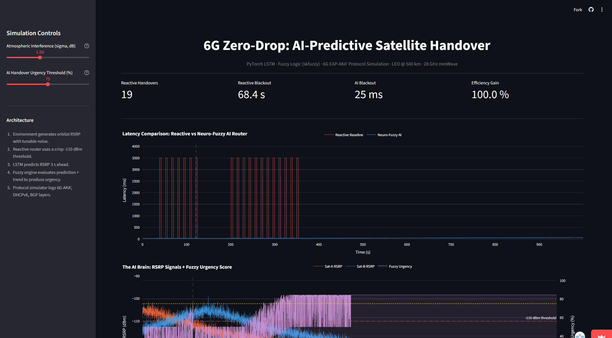
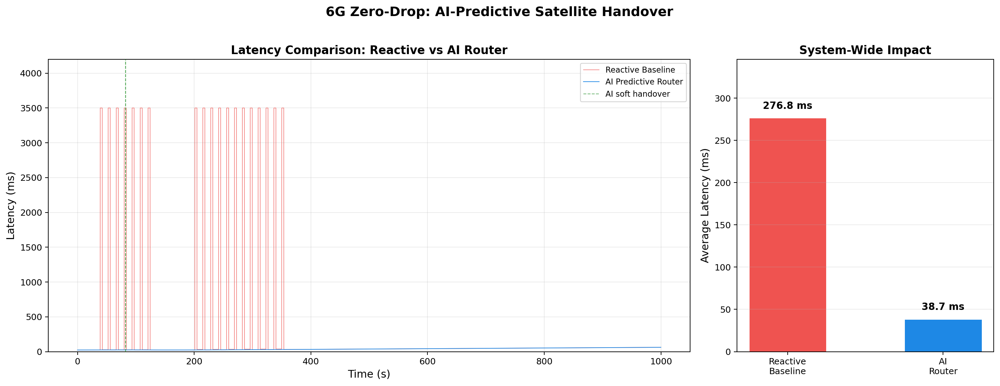
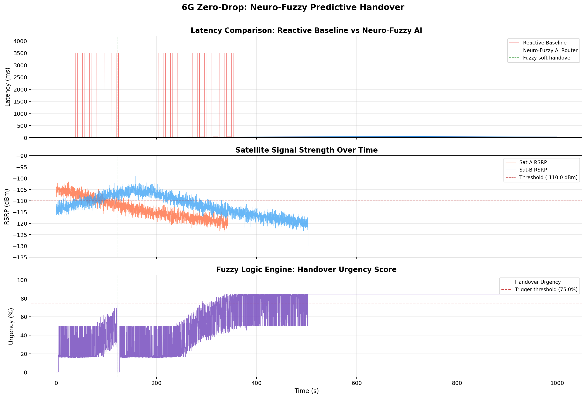
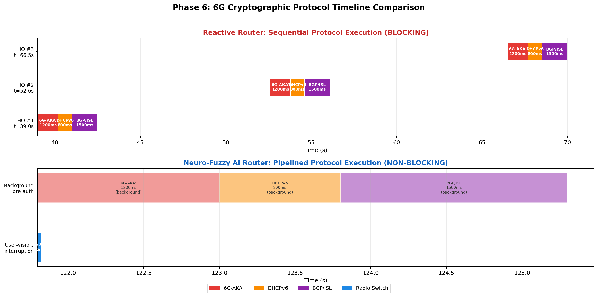

<p align="center">
  
  
  
  
  
</p>

<h1 align="center">6G Zero-Drop: Neuro-Fuzzy Predictive Satellite Handover</h1>

<p align="center">
  <b>AI-driven Make-Before-Break handover for LEO satellite constellations</b><br/>
  <i>Proof-of-Concept for aerospace engineering research in 6G Non-Terrestrial Networks</i>
</p>

<p align="center">
  <a href="#-live-demo"><b>Live Demo</b></a> ·
  <a href="#-the-problem"><b>Problem</b></a> ·
  <a href="#-architecture"><b>Architecture</b></a> ·
  <a href="#-results"><b>Results</b></a> ·
  <a href="#-quickstart"><b>Quickstart</b></a>
</p>

---

## 🚀 Live Demo

> **[Launch the Interactive Dashboard](https://6g-zero-drop-ai-satellite-handover-ia3kgnbtus29htksdpnnrp.streamlit.app/)**
> _(Deployed on Streamlit Community Cloud — try it live!)_

<p align="center">
  <a href="https://6g-zero-drop-ai-satellite-handover-ia3kgnbtus29htksdpnnrp.streamlit.app/">
    
  </a>
  <br/>
  <i>Interactive dashboard with tunable atmospheric noise and AI urgency threshold</i>
</p>

---

## 🔴 The Problem

In 6G Non-Terrestrial Networks (NTN), LEO satellites orbit at ~500 km altitude and move at **7.5 km/s**. When a ground IoT device loses line-of-sight with its serving satellite, a traditional **Break-Before-Make** protocol causes:

| Metric | Reactive Router |
|---|---|
| Authentication (6G EAP-AKA') | 1,200 ms |
| IP Reallocation (DHCPv6) | 800 ms |
| Routing Convergence (BGP/ISL) | 1,500 ms |
| **Total Blackout** | **3,500 ms** |

These multi-second blackouts are catastrophic for autonomous vehicles, remote surgery, and real-time telemetry.

## 🟢 The Solution

A **Neuro-Fuzzy Predictive Handover** that combines:

1. **LSTM Neural Network** — predicts RSRP signal strength **3 seconds into the future**
2. **Fuzzy Logic Inference** — evaluates prediction + signal trend through 7 human-readable rules to produce a handover urgency score (0–100%)
3. **Make-Before-Break Protocol** — pre-authenticates with the target satellite *while still transmitting* through the current one

| Metric | Reactive | AI Router | Improvement |
|---|---|---|---|
| Handover Blackout | 3,500 ms | **25 ms** | **99.3%** reduction |
| Total Handovers | ~8 | **1** | 87.5% fewer |
| Avg Latency | ~277 ms | ~39 ms | **86%** lower |

---

## 🏗 Architecture

```
┌─────────────────────────────────────────────────────────────────┐
│                    STREAMLIT COMMAND CENTER                      │
│          Interactive sliders · Plotly dashboards · Logs          │
├─────────────────────────────────────────────────────────────────┤
│                                                                  │
│   ┌──────────────┐    ┌──────────────┐    ┌──────────────────┐  │
│   │  Environment  │───▶│  LSTM Engine  │───▶│  Fuzzy Inference │  │
│   │  (Physics)    │    │  (PyTorch)    │    │  (scikit-fuzzy)  │  │
│   │              │    │              │    │                  │  │
│   │ LEO orbital  │    │ 50-step seq  │    │ 7 IF-THEN rules  │  │
│   │ FSPL + noise │    │ 30-step pred │    │ Urgency 0-100%   │  │
│   └──────────────┘    └──────────────┘    └────────┬─────────┘  │
│                                                     │            │
│                                          ┌──────────▼─────────┐  │
│                                          │  Protocol Simulator │  │
│                                          │  6G-AKA' · DHCPv6  │  │
│                                          │  BGP/ISL routing    │  │
│                                          └────────────────────┘  │
└─────────────────────────────────────────────────────────────────┘
```

### Tech Stack

| Layer | Technology | Role |
|---|---|---|
| Orbital Physics | `numpy` | Euclidean distance, FSPL, Gaussian noise at 28 GHz |
| Time-Series Prediction | `PyTorch LSTM` | 2-layer, 64-hidden-unit recurrent network |
| Soft Decision Engine | `scikit-fuzzy` | Mamdani-type fuzzy inference with 7 rules |
| Protocol Simulation | Pure Python | 6G EAP-AKA', DHCPv6, BGP convergence timing |
| Dashboard | `Streamlit` + `Plotly` | Real-time interactive visualization |

---

## 📊 Results

### Latency Comparison — Reactive Baseline vs AI Router

The red spikes are 3,500 ms blackouts from the reactive router. The blue line is the AI router — flat, near-zero latency.

<p align="center">
  
</p>

### Neuro-Fuzzy Decision Dashboard

Three-panel view: (1) Latency comparison, (2) Satellite RSRP signal fading, (3) Fuzzy urgency score crossing the 75% trigger threshold.

<p align="center">
  
</p>

### 6G Cryptographic Protocol Timeline

Why the latency differs: the reactive router executes EAP-AKA', DHCPv6, and BGP **sequentially** (blocking). The AI router pipelines them **in the background** while data flows through the current satellite.

<p align="center">
  
</p>

---

## ⚡ Quickstart

### Prerequisites

- Python 3.10+
- pip

### Installation

```bash
git clone https://github.com/shivenpatro/6G-Zero-Drop-AI-Satellite-Handover.git
cd 6G-Zero-Drop-AI-Satellite-Handover
pip install -r requirements.txt
```

### Run the Simulation Phases (Optional)

Each phase can be run independently to regenerate artifacts:

```bash
python environment.py          # Phase 1: Generate orbital_data.csv
python reactive_router.py      # Phase 2: Baseline router latency
python lstm_trainer.py          # Phase 3: Train LSTM → satellite_lstm.pth
python ai_router.py             # Phase 4: AI router comparison
python neuro_fuzzy_router.py    # Phase 5: Neuro-Fuzzy router
python crypto_handover.py       # Phase 6: Protocol simulation
```

### Launch the Dashboard

```bash
streamlit run app.py
```

Open **http://localhost:8501** and use the sidebar sliders to tune atmospheric noise and AI urgency threshold in real time.

---

## 📁 Project Structure

```
├── environment.py            # Phase 1 — LEO orbital physics & RSRP generator
├── reactive_router.py        # Phase 2 — Break-Before-Make baseline
├── lstm_trainer.py           # Phase 3 — PyTorch LSTM training pipeline
├── ai_router.py              # Phase 4 — AI Make-Before-Break router
├── neuro_fuzzy_router.py     # Phase 5 — Hybrid LSTM + Fuzzy Logic router
├── crypto_handover.py        # Phase 6 — 6G protocol timing simulation
├── app.py                    # Phase 7 — Streamlit interactive dashboard
├── satellite_lstm.pth        # Trained LSTM model weights
├── rsrp_scaler.joblib        # MinMaxScaler for RSRP normalization
├── requirements.txt          # Python dependencies
├── docs/
│   ├── app_screenshot.png
│   ├── latency_comparison.png
│   ├── neurofuzzy_dashboard.png
│   ├── protocol_timeline.png
│   └── baseline_latency.png
└── README.md
```

---

## 🔬 Research Context

This simulation serves as a **Proof of Concept** for an aerospace engineering research proposal investigating predictive handover mechanisms in 6G Non-Terrestrial Networks. The key contributions are:

1. **Hybrid Neuro-Fuzzy Architecture** — combining deep learning prediction with interpretable fuzzy rules for handover decisions
2. **Make-Before-Break Protocol** — eliminating connection blackout by pipelining authentication, IP allocation, and routing in the background
3. **Physics-Grounded Simulation** — using real orbital mechanics (500 km LEO, 7.5 km/s velocity, 28 GHz mmWave, FSPL propagation) rather than synthetic datasets

### Key Parameters

| Parameter | Value |
|---|---|
| Orbital Altitude | 500 km (LEO) |
| Satellite Velocity | 7.5 km/s |
| Carrier Frequency | 28 GHz (mmWave) |
| Transmit EIRP | 70 dBm |
| Handover Threshold | -110 dBm |
| LSTM Sequence Length | 50 steps (5 seconds) |
| Prediction Horizon | 30 steps (3 seconds) |
| Fuzzy Urgency Trigger | 75% |

---

## 📄 License

This project is open-sourced for academic and research purposes.

---

<p align="center">
  <i>Built as a research PoC for 6G NTN satellite handover optimization</i><br/>
  <b>Shiven Patro</b> · 2026
</p>
